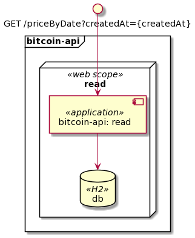

# components-diagram

Diagram to show the components of solution

| COMPONENT | TYPE | COMMENTS |
| :---: | :---: | :---: |
| read | web scope | Scope for retrieve prices of specific bitcoin in a cetaint time
| db | H2 | in-memory database that stores the price list for a certain time for the bitcoin